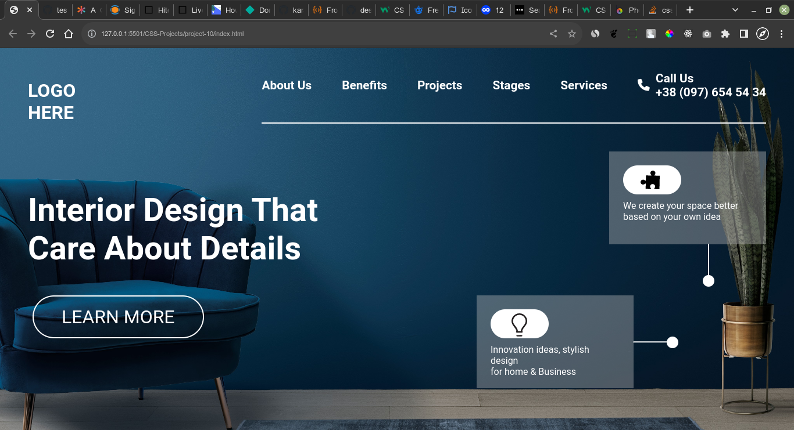

# Project10 [live link](https://css-projects-10.netlify.app/)

## By - Karan Chauhan

- CSS property I learned in this project
    - image sprites
    - flex-end
    - opacity in background
    - text-transform
    - `rotate()`

## Time taken to complete this project
    - 3 hours + 3 hours(responsive)

## Screenshot
